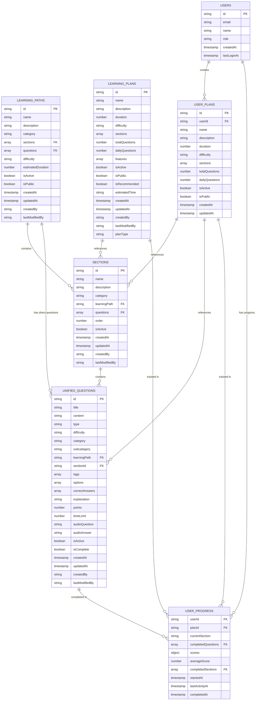
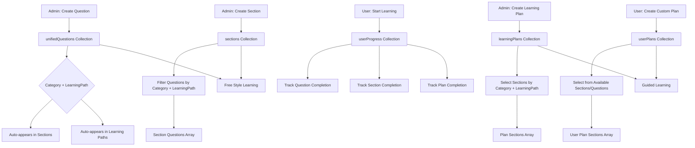

# Firebase Entity Relationship Diagram

## Visual Representation of Data Structure

## Data Flow Diagram

## Collection Relationships Summary

### 1. **Core Content Collections**

- `unifiedQuestions` - Central question repository
- `sections` - Groups related questions
- `learningPaths` - Organizes sections and questions

### 2. **Plan Collections**

- `learningPlans` - Admin-created guided plans
- `userPlans` - User-created custom plans

### 3. **Progress Tracking**

- `userProgress` - Tracks user completion status

### 4. **Linking Strategy**

- **Questions → Sections**: Based on `category` + `learningPath`
- **Sections → Plans**: Direct reference by `sectionId`
- **Questions → Plans**: Can be direct or through sections
- **User Progress**: Tracks completion across all entities

### 5. **Admin Interface Flow**

1. **Questions** (`/admin/content/questions`) → `unifiedQuestions`
2. **Sections** (`/admin/sections`) → `sections` (auto-links questions)
3. **Plans** (`/admin/guided-learning`) → `learningPlans` (selects sections)

### 6. **User Interface Flow**

1. **Free Style**: Browse all questions by category/learning path
2. **Guided Learning**: Follow pre-built or custom plans
3. **Progress**: Tracked in `userProgress` collection

This structure ensures that:

- Questions are centrally managed and automatically categorized
- Sections automatically include relevant questions
- Learning plans can be built from sections or individual questions
- Users can create custom plans mixing different sources
- Progress is tracked consistently across all learning modes

