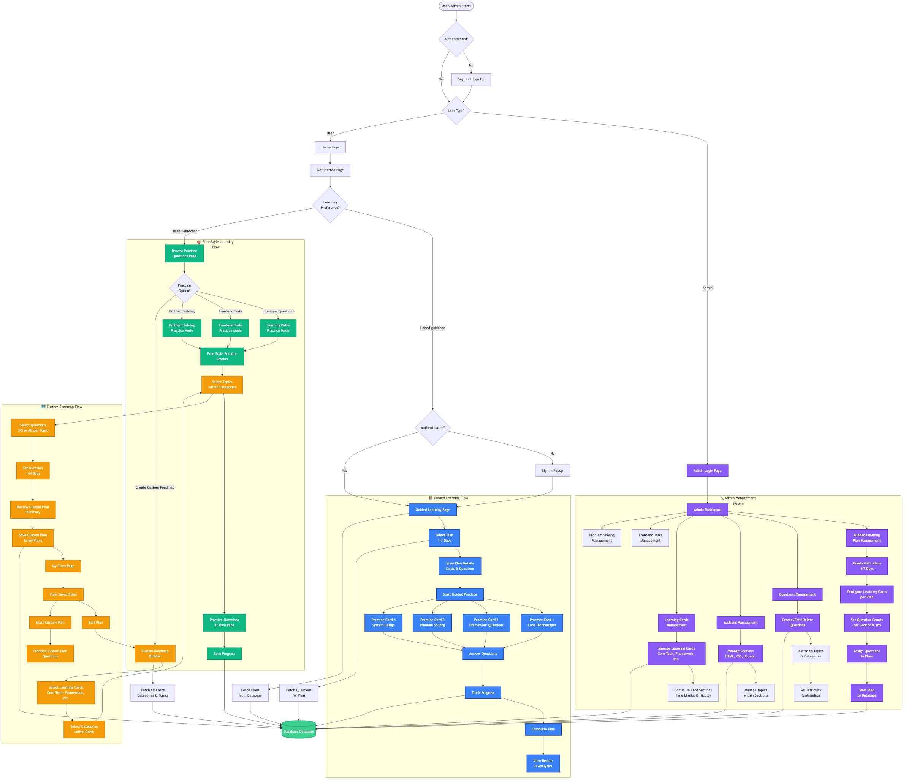

# Elzatona Web - Frontend Developer Learning Platform

## Overview

This is an **Nx monorepo** workspace containing a comprehensive platform for frontend developers to practice coding challenges and prepare for technical interviews.

**Workspace Name:** `zatona-web`  
**Nx Version:** 18.0.4  
**Package Manager:** npm  
**Build Tool:** Next.js 14.0.4  
**Framework:** React 18.2.0

---

## 🎯 Project Flow Diagram

The following diagram illustrates the complete system flow covering Admin management, Guided Learning, Free-Style Learning, and Custom Roadmap features:



For more details, see the [complete flow documentation](./docs/diagrams/project-flow-diagram.md).

---

## 🔄 System Flows

### 🔧 Admin Flow

**Purpose:** Content management, plan configuration, and system administration

**User Journey:**

1. **Admin Login** → Access admin dashboard at `/admin/login`
2. **Dashboard Overview** → View system statistics, recent activity, and content metrics
3. **Content Management**:
   - **Guided Learning Plans**: Create/edit 1-7 day learning plans with cumulative question distribution
   - **Questions Management**: CRUD operations for all question types (multiple-choice, open-ended, code, true-false)
   - **Sections Management**: Organize content by sections (HTML, CSS, JavaScript, React, etc.)
   - **Learning Cards**: Configure four main card types (Core Technologies, Framework Questions, Problem Solving, System Design)
   - **Frontend Tasks**: Manage React/frontend coding challenges with starter code
   - **Problem Solving**: Manage algorithmic challenges with test cases
4. **Configuration**:
   - Set question counts per section/card
   - Configure time limits and difficulty levels
   - Assign questions to specific plans with cumulative distribution
5. **Data Persistence** → All changes saved to Supabase Database

**Key Features:**

- Full CRUD operations for all content types
- Bulk operations for efficient content management
- Real-time preview of plan configurations
- Question assignment with automatic cumulative distribution across plans

---

### 📚 Guided Learning Flow

**Purpose:** Structured learning paths with predefined plans and progress tracking

**User Journey:**

1. **Entry Point** → User visits `/get-started` and selects **"I need guidance"**
2. **Authentication** → Sign-in popup appears (if not authenticated)
3. **Plan Selection** → Navigate to `/guided-learning` with dynamic plans (1-7 days)
4. **Plan Overview** → View plan details:
   - Total questions per plan
   - Daily question distribution
   - Estimated completion time
   - Learning objectives
5. **Practice Session** → Four learning cards:
   - **Card 1: Core Technologies** (HTML, CSS, JavaScript, TypeScript fundamentals)
   - **Card 2: Framework Questions** (React, Next.js, Vue, Angular, etc.)
   - **Card 3: Problem Solving** (Frontend coding challenges and algorithms)
   - **Card 4: System Design** (Frontend architecture patterns)
6. **Question Practice**:
   - Answer questions with real-time feedback
   - View explanations and hints
   - Track time spent per question
7. **Progress Tracking**:
   - Real-time progress saved to database
   - Completion percentage per card
   - Overall plan completion status
8. **Results & Analytics** → View performance metrics and recommendations

**Key Features:**

- **Cumulative Question System**: Each plan includes all questions from previous plans plus new ones
  - Plan 1 (1-Day): 100 base questions
  - Plan 2 (2-Day): Plan 1 + 50 new questions = 150 total
  - Plan 3 (3-Day): Plan 2 + 50 new questions = 200 total
  - ...continues up to Plan 7
- Dynamic content fetched from Supabase
- Progress persistence across sessions
- Adaptive difficulty based on performance

---

### 🎯 Free-Style Learning Flow

**Purpose:** Flexible practice modes allowing users to learn at their own pace

**User Journey:**

1. **Entry Point** → User visits `/get-started` and selects **"I'm self-directed"**
2. **Practice Selection** → Navigate to `/browse-practice-questions`
3. **Choose Practice Mode**:
   - **Interview Questions** → `/learning-paths` - Practice questions organized by topics
   - **Frontend Tasks** → `/frontend-tasks` - React/frontend coding challenges with CodeSandbox-like environment
   - **Problem Solving** → `/problem-solving` - Algorithmic challenges with test cases
   - **Create Custom Roadmap** → `/custom-roadmap` - Build personalized learning path
4. **Flexible Practice**:
   - Select topics freely from available categories
   - Practice questions at own pace
   - No time constraints or mandatory order
   - Access to all content without plan restrictions
5. **Progress Tracking**:
   - Save progress per question/task
   - Track time spent
   - View completion statistics

**Key Features:**

- No authentication required for basic practice
- Full access to all questions and content
- Flexible topic selection
- Self-paced learning without structured timelines
- Integration with custom roadmap creation

---

### 🗺️ Custom Roadmap Flow

**Purpose:** User-created personalized learning paths with granular control

**User Journey:**

1. **Roadmap Builder** → Navigate to `/custom-roadmap` (requires authentication)
2. **Card Selection** → Choose from learning cards:
   - Core Technologies
   - Framework Questions
   - Problem Solving
   - System Design
3. **Category Selection** → Select categories within chosen cards
4. **Topic Selection** → Choose specific topics within categories
5. **Question Selection** → For each topic:
   - View all available questions
   - Select 3-5 questions or all questions per topic
   - Preview question difficulty and estimated time
6. **Plan Configuration**:
   - Set plan name and description
   - Configure duration (1 day to N days)
   - Review total questions and daily distribution
7. **Save Plan** → Save to "My Plans" with unique identifier
8. **Plan Management** → Navigate to `/my-plans`:
   - View all saved custom plans
   - Edit existing plans
   - Delete plans
   - Start practice with selected plan
9. **Practice Custom Plan**:
   - Follow selected questions in configured order
   - Track progress per question
   - Complete plan at own pace

**Key Features:**

- **Granular Control**: Select specific questions from topics (not just topics)
- **Flexible Duration**: Set custom timeline (1 day to unlimited)
- **Question Preview**: See question details before selection
- **Plan Persistence**: All plans saved per user in database
- **Edit & Manage**: Modify saved plans anytime
- **Progress Tracking**: Track completion of custom plans

**Available Sections:**

- HTML Fundamentals
- CSS Fundamentals
- JavaScript Fundamentals
- TypeScript Fundamentals
- React Mastery
- Next.js Advanced
- Behavioral & Soft Skills
- AI Tools for Frontend
- Performance Optimization
- Security Best Practices
- Design Patterns
- System Design

---

## 🔄 Key Features Summary

### Admin System

- ✅ Full CRUD operations for all content types
- ✅ Plan configuration with cumulative question distribution
- ✅ Bulk operations for efficient content management
- ✅ Real-time content preview and validation

### Guided Learning

- ✅ Structured 1-7 day plans with cumulative questions
- ✅ Four learning cards per plan
- ✅ Real-time progress tracking
- ✅ Dynamic content from database
- ✅ Performance analytics

### Free-Style Learning

- ✅ Flexible topic selection
- ✅ Multiple practice modes (Interview, Frontend Tasks, Problem Solving)
- ✅ Self-paced learning
- ✅ No authentication required for basic access

### Custom Roadmap

- ✅ User-created personalized learning paths
- ✅ Granular question selection (3-5 or all per topic)
- ✅ Flexible duration configuration
- ✅ Plan management (create, edit, delete, start)
- ✅ Progress tracking for custom plans

### Data & Infrastructure

- ✅ Centralized Supabase storage for all data
- ✅ Real-time progress synchronization
- ✅ User authentication and session management
- ✅ Scalable architecture with Nx monorepo

---

## Root Directory Structure

```
elzatona-web/
├── apps/                    # Application projects (2 apps)
│   ├── website/            # Main website application
│   └── admin/              # Admin dashboard application
├── libs/                   # Shared libraries (4 libraries)
│   ├── ui/                 # UI components library
│   ├── auth/               # Authentication library
│   ├── database/           # Database abstraction library
│   └── utils/              # Utility functions library
├── tools/                  # Build and development tools
├── dist/                   # Build output directory
├── node_modules/           # Dependencies
├── docs/                   # Documentation
├── .vscode/                # VS Code configuration
├── .git/                   # Git repository
├── nx.json                 # Nx workspace configuration
├── package.json            # Root package dependencies and scripts
├── tsconfig.base.json      # Base TypeScript configuration
├── .eslintrc.json          # ESLint configuration
├── .prettierrc             # Prettier configuration
└── README.md               # Project documentation
```

---

## Nx Configuration

### nx.json

- **NPM Scope:** `@zatona-web`
- **Default Project:** `website`
- **Task Runner:** `nx/tasks-runners/default`
- **Cacheable Operations:** build, lint, test, e2e
- **Generators:** Configured for Next.js with Tailwind CSS

### Target Defaults

- **build:** Depends on dependencies' build
- **test:** Uses default and production inputs
- **lint:** Uses ESLint configuration

---

## Applications (apps/)

The workspace contains **2 applications**:

### 1. Website Application (apps/website/)

Main frontend learning platform with comprehensive features.

```
apps/website/
├── src/
│   ├── app/                # Next.js app directory
│   │   ├── admin/         # Admin pages
│   │   ├── api/           # API routes
│   │   ├── frontend-tasks/# Frontend tasks
│   │   ├── learning/      # Learning modules
│   │   └── ...            # Other pages
│   ├── shared/            # Shared components
│   │   ├── components/    # React components
│   │   ├── contexts/      # React contexts
│   │   ├── hooks/         # Custom hooks
│   │   └── lib/           # Utility libraries
│   ├── atoms/             # Jotai atoms
│   ├── providers/         # Context providers
│   ├── types/             # TypeScript types
│   └── utils/             # Utility functions
├── public/                # Static assets
├── project.json           # Nx project configuration
├── next.config.ts         # Next.js configuration
├── tsconfig.json          # TypeScript configuration
└── tailwind.config.ts     # Tailwind CSS configuration
```

### 2. Admin Application (apps/admin/)

Admin dashboard for content management and system administration.

```
apps/admin/
├── src/
│   └── app/               # Admin pages
├── network/               # Network data and scripts
│   ├── data/              # Question data and content
│   └── Utils/             # Admin utilities
│       └── scripts/       # Management scripts
├── public/                # Admin static assets
├── project.json           # Nx project configuration
├── next.config.js         # Next.js configuration
└── tsconfig.json          # TypeScript configuration
```

---

## Shared Libraries (libs/)

The workspace includes **4 shared libraries**:

### 1. UI Library (libs/ui/)

Reusable UI components built with Radix UI and Tailwind CSS.

```
libs/ui/
├── src/
│   ├── lib/
│   │   ├── button.tsx     # Button component
│   │   ├── input.tsx      # Input component
│   │   ├── card.tsx       # Card component
│   │   └── ...            # Other UI components
│   └── index.ts           # Barrel export
├── project.json
├── tsconfig.json
└── vite.config.ts
```

### 2. Auth Library (libs/auth/)

Authentication and authorization utilities.

```
libs/auth/
├── src/
│   ├── lib/
│   │   ├── auth.ts        # Auth utilities
│   │   ├── providers.tsx  # Auth providers
│   │   └── hooks.ts       # Auth hooks
│   └── index.ts           # Barrel export
├── project.json
├── tsconfig.json
└── vite.config.ts
```

### 3. Database Library (libs/database/)

Database abstraction layer supporting multiple providers.

```
libs/database/
├── src/
│   ├── lib/
│   │   ├── IDatabaseService.ts      # Database interface
│   │   ├── SupabaseDatabaseService.ts # Supabase implementation
│   │   ├── DatabaseContext.tsx      # React context
│   │   └── appConfig.ts             # Configuration
│   └── index.ts                     # Barrel export
├── project.json
├── tsconfig.json
└── vite.config.ts
```

### 4. Utils Library (libs/utils/)

Shared utility functions and helpers.

```
libs/utils/
├── src/
│   ├── lib/
│   │   ├── utils.ts       # Utility functions
│   │   ├── cn.ts          # Class name utilities
│   │   └── ...            # Other utilities
│   └── index.ts           # Barrel export
├── project.json
├── tsconfig.json
└── vite.config.ts
```

---

## Tools & Scripts (tools/)

```
tools/
├── scripts/               # Build and deployment scripts
└── templates/             # Project templates
    └── next-app/          # Next.js app template
        ├── src/
        │   ├── app/
        │   ├── components/
        │   └── lib/
        └── public/
```

---

## Key Technologies & Dependencies

### Core Framework

- **React:** 18.2.0
- **Next.js:** 14.0.4
- **TypeScript:** ~5.3.2

### State Management

- **Jotai:** ^2.6.3
- **TanStack Query:** ^5.17.19

### UI & Styling

- **Tailwind CSS:** 3.2.7
- **Radix UI:** Multiple packages
- **Lucide React:** ^0.312.0
- **Framer Motion:** ^10.18.0

### Database & Backend

- **Supabase:** ^2.39.3
- **NextAuth.js:** ^4.24.5

### Form Handling

- **React Hook Form:** ^7.49.3
- **Zod:** ^3.22.4

### Development Tools

- **Nx:** 18.0.4
- **ESLint:** ~8.48.0
- **Prettier:** ^2.6.2
- **Husky:** ^8.0.0

### Testing

- **Jest:** ^29.4.1
- **Playwright:** ^1.40.0
- **Testing Library:** 14.0.0

---

## Build & Development Scripts

### Website Application Scripts

```bash
# Development
npm run dev                    # Start dev server
npm run dev:turbo              # Start with Turbopack

# Build
npm run build                  # Production build
npm run build:check            # Build with validation

# Testing
npm run test                   # Run all tests
npm run test:e2e               # Run E2E tests
```

### Admin Application Scripts

```bash
# Development
npm run dev:admin              # Start admin dev server

# Build
npm run build:admin            # Build admin app
```

### Library Scripts

```bash
# Test individual libraries
npm run test:ui                # Test UI library
npm run test:auth              # Test auth library
npm run test:database          # Test database library
npm run test:utils             # Test utils library
```

---

## Environment Configuration

### Environment Files

- `.env.local` - Local environment variables
- `.env.example` - Environment template

### Required Environment Variables

```bash
# Supabase Configuration
NEXT_PUBLIC_SUPABASE_URL=your_supabase_url
NEXT_PUBLIC_SUPABASE_ANON_KEY=your_supabase_anon_key
SUPABASE_SERVICE_ROLE_KEY=your_service_role_key

# NextAuth Configuration
NEXTAUTH_URL=http://localhost:3000
NEXTAUTH_SECRET=your_nextauth_secret
```

---

## Development Workflow

1. **Start Development Server**

   ```bash
   npm run dev
   ```

2. **Make Changes**
   - Edit files in `apps/website/src/` or `apps/admin/src/`
   - Hot module replacement (HMR) updates automatically

3. **Run Tests**

   ```bash
   npm run test
   ```

4. **Build for Production**
   ```bash
   npm run build
   ```

---

## Project Conventions

### File Naming

- **Components:** PascalCase (e.g., `UserProfile.tsx`)
- **Utilities:** camelCase (e.g., `helpers.ts`)
- **Types:** PascalCase interfaces (e.g., `UserType`)

### Directory Structure

- Each component has its own directory
- Barrel exports (`index.ts`) for cleaner imports
- Shared code in `libs/` directory

### TypeScript

- Strict mode enabled
- Type definitions in separate files
- Shared types in `libs/` libraries

### Styling

- Tailwind CSS for utility classes
- Radix UI for accessible components
- CSS modules for component-specific styles

---

## Database Architecture

### Supabase Integration

- **Authentication:** User management and sessions
- **Database:** PostgreSQL with real-time subscriptions
- **Storage:** File uploads and assets
- **Edge Functions:** Serverless API endpoints

### Database Abstraction

- **IDatabaseService:** Interface for database operations
- **SupabaseDatabaseService:** Supabase implementation
- **DatabaseContext:** React context for dependency injection
- **Multi-provider support:** Easy switching between databases

---

## Best Practices

### Component Development

- Keep components small and focused
- Use TypeScript for type safety
- Implement proper error boundaries
- Write reusable components in `libs/ui/`

### State Management

- Use Jotai for global state
- Use React hooks for local state
- Keep atoms focused and modular

### API Integration

- Centralize API calls in `libs/database/`
- Use Supabase client for database operations
- Handle errors consistently

### Performance

- Lazy load routes and components
- Optimize bundle size with Nx
- Use Next.js code splitting
- Leverage Nx caching

---

## Troubleshooting

### Common Issues

1. **Build Failures**
   - Clear Nx cache: `npx nx reset`
   - Delete `node_modules` and reinstall
   - Check TypeScript errors

2. **Port Conflicts**
   - Change port in `next.config.ts`
   - Kill processes using the port

3. **Module Resolution**
   - Check `tsconfig.base.json` paths
   - Verify library exports in `index.ts`

---

## Additional Resources

- **Nx Documentation:** https://nx.dev
- **Next.js Documentation:** https://nextjs.org/docs
- **React Documentation:** https://react.dev
- **Supabase Documentation:** https://supabase.com/docs
- **Tailwind CSS Documentation:** https://tailwindcss.com/docs

---

## Summary

This is a comprehensive **Nx monorepo** containing a **frontend learning platform** with **2 applications** and **4 shared libraries**. The **website application** provides coding challenges, learning modules, and interview preparation tools, while the **admin application** manages content and system administration. The workspace uses modern technologies like React 18, Next.js 14, TypeScript, Supabase, and Tailwind CSS, with strong emphasis on code sharing, build optimization, and scalability through the Nx build system.
