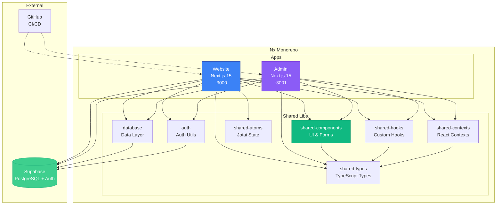
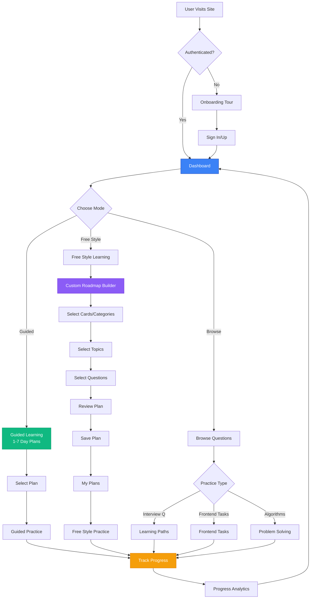
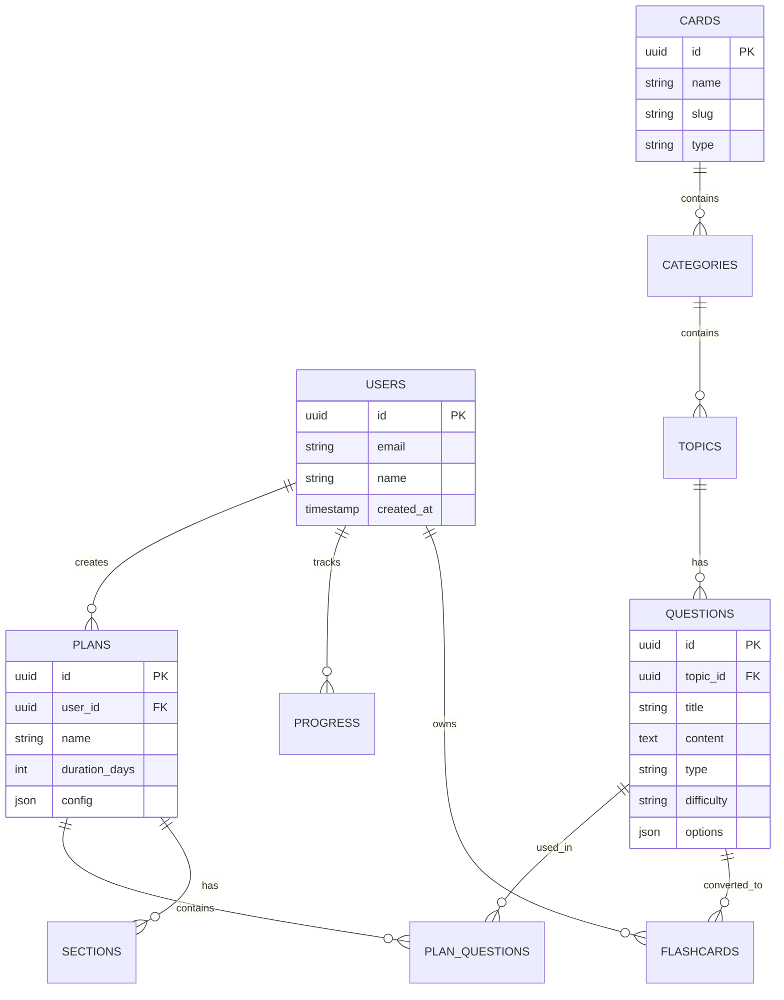
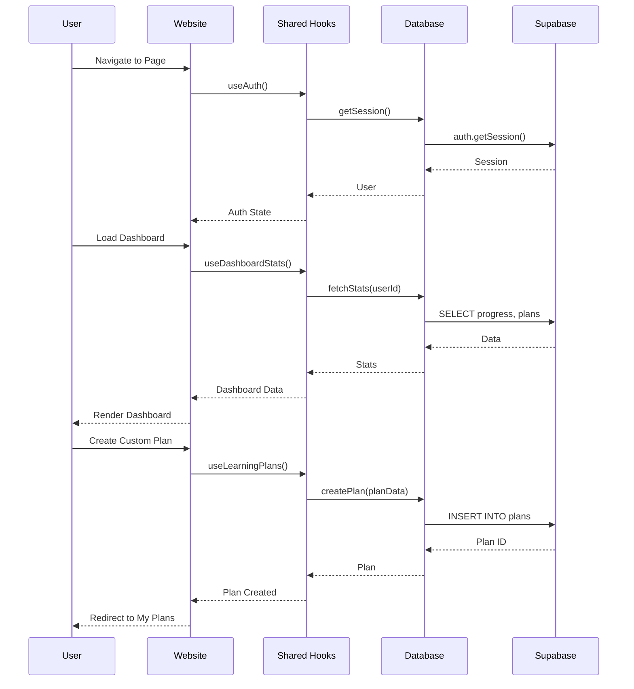
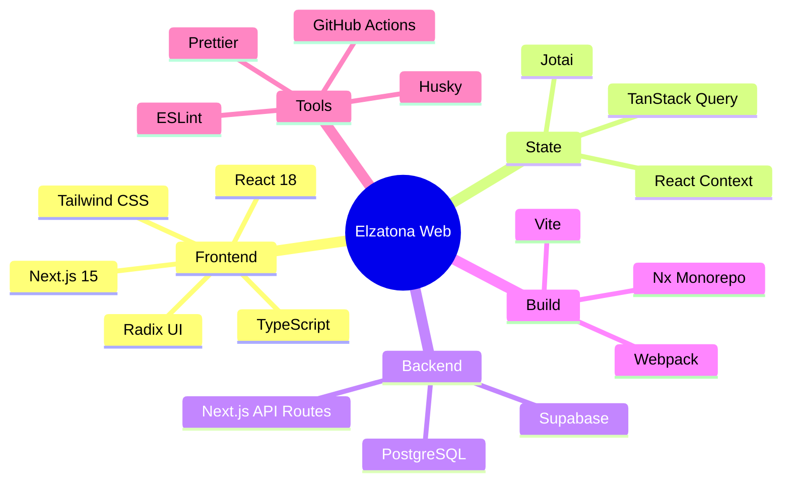

# Elzatona Web - Architecture Overview

## 🏗️ Complete System Architecture

```mermaid
graph TB
    subgraph "Nx Monorepo"
        subgraph "Apps"
            W[Website<br/>Next.js 15<br/>:3000]
            A[Admin<br/>Next.js 15<br/>:3001]
        end

        subgraph "Shared Libs"
            SC[shared-components<br/>UI & Forms]
            SX[shared-contexts<br/>React Contexts]
            SH[shared-hooks<br/>Custom Hooks]
            ST[shared-types<br/>TypeScript Types]
            SA[shared-atoms<br/>Jotai State]
            DB[database<br/>Data Layer]
            AU[auth<br/>Auth Utils]
        end
    end

    subgraph "External"
        SB[(Supabase<br/>PostgreSQL + Auth)]
        GH[GitHub<br/>CI/CD]
    end

    W --> SC & SX & SH & ST & SA & DB & AU
    A --> SC & SX & SH & ST & DB & AU
    SC & SH & SX --> ST
    DB & AU --> SB
    W & A --> SB
    GH -.-> W & A

    style W fill:#3b82f6,stroke:#1e40af,color:#fff
    style A fill:#8b5cf6,stroke:#6d28d9,color:#fff
    style SC fill:#10b981,stroke:#059669,color:#fff
    style SB fill:#3ecf8e,stroke:#24b47e,color:#fff
```

## 🎯 Core Features Flow

```mermaid
flowchart TD
    Start[User Visits Site] --> Auth{Authenticated?}
    Auth -->|No| Onboarding[Onboarding Tour]
    Auth -->|Yes| Dashboard[Dashboard]

    Onboarding --> SignIn[Sign In/Up]
    SignIn --> Dashboard

    Dashboard --> Mode{Choose Mode}

    Mode -->|Guided| Guided[Guided Learning<br/>1-7 Day Plans]
    Mode -->|Free Style| FreeStyle[Free Style Learning]
    Mode -->|Browse| Browse[Browse Questions]

    Guided --> SelectPlan[Select Plan]
    SelectPlan --> GuidedPractice[Guided Practice]

    FreeStyle --> Roadmap[Custom Roadmap Builder]
    Roadmap --> SelectCards[Select Cards/Categories]
    SelectCards --> SelectTopics[Select Topics]
    SelectTopics --> SelectQuestions[Select Questions]
    SelectQuestions --> Review[Review Plan]
    Review --> SavePlan[Save Plan]
    SavePlan --> MyPlans[My Plans]
    MyPlans --> FreeStylePractice[Free Style Practice]

    Browse --> PracticeTypes{Practice Type}
    PracticeTypes -->|Interview Q| LearningPaths[Learning Paths]
    PracticeTypes -->|Frontend Tasks| FrontendTasks[Frontend Tasks]
    PracticeTypes -->|Algorithms| ProblemSolving[Problem Solving]

    GuidedPractice --> Progress[Track Progress]
    FreeStylePractice --> Progress
    LearningPaths --> Progress
    FrontendTasks --> Progress
    ProblemSolving --> Progress

    Progress --> Analytics[Progress Analytics]
    Analytics --> Dashboard

    style Dashboard fill:#3b82f6,stroke:#1e40af,color:#fff
    style Guided fill:#10b981,stroke:#059669,color:#fff
    style Roadmap fill:#8b5cf6,stroke:#6d28d9,color:#fff
    style Progress fill:#f59e0b,stroke:#d97706,color:#fff
```

## üìä Data Model Relationships

```mermaid
erDiagram
    USERS ||--o{ PLANS : creates
    USERS ||--o{ PROGRESS : tracks
    USERS ||--o{ FLASHCARDS : owns

    PLANS ||--o{ PLAN_QUESTIONS : contains
    PLANS ||--o{ SECTIONS : has

    CARDS ||--o{ CATEGORIES : contains
    CATEGORIES ||--o{ TOPICS : contains
    TOPICS ||--o{ QUESTIONS : has

    QUESTIONS ||--o{ PLAN_QUESTIONS : used_in
    QUESTIONS ||--o{ FLASHCARDS : converted_to

    USERS {
        uuid id PK
        string email
        string name
        timestamp created_at
    }

    PLANS {
        uuid id PK
        uuid user_id FK
        string name
        int duration_days
        json config
    }

    CARDS {
        uuid id PK
        string name
        string slug
        string type
    }

    QUESTIONS {
        uuid id PK
        uuid topic_id FK
        string title
        text content
        string type
        string difficulty
        json options
    }
```

## 🔄 Request Flow

```mermaid
sequenceDiagram
    participant U as User
    participant W as Website
    participant H as Shared Hooks
    participant D as Database
    participant S as Supabase

    U->>W: Navigate to Page
    W->>H: useAuth()
    H->>D: getSession()
    D->>S: auth.getSession()
    S-->>D: Session
    D-->>H: User
    H-->>W: Auth State

    U->>W: Load Dashboard
    W->>H: useDashboardStats()
    H->>D: fetchStats(userId)
    D->>S: SELECT progress, plans
    S-->>D: Data
    D-->>H: Stats
    H-->>W: Dashboard Data
    W-->>U: Render Dashboard

    U->>W: Create Custom Plan
    W->>H: useLearningPlans()
    H->>D: createPlan(planData)
    D->>S: INSERT INTO plans
    S-->>D: Plan ID
    D-->>H: Plan
    H-->>W: Plan Created
    W-->>U: Redirect to My Plans
```

## 🛠️ Technology Stack

```mermaid
mindmap
  root((Elzatona Web))
    Frontend
      Next.js 15
      React 18
      TypeScript
      Tailwind CSS
      Radix UI
    State
      Jotai
      React Context
      TanStack Query
    Backend
      Supabase
      PostgreSQL
      Next.js API Routes
    Build
      Nx Monorepo
      Vite
      Webpack
    Tools
      ESLint
      Prettier
      Husky
      GitHub Actions
```
