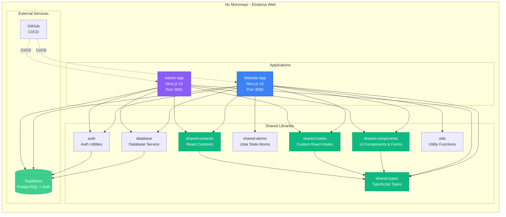
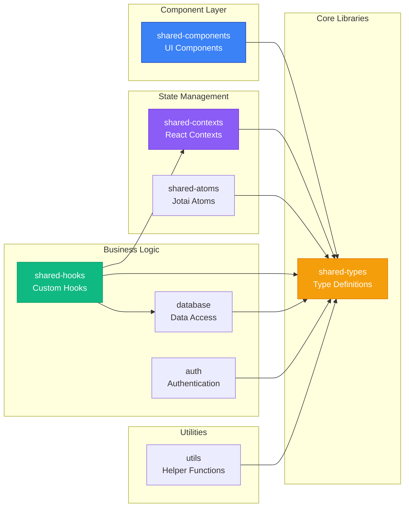
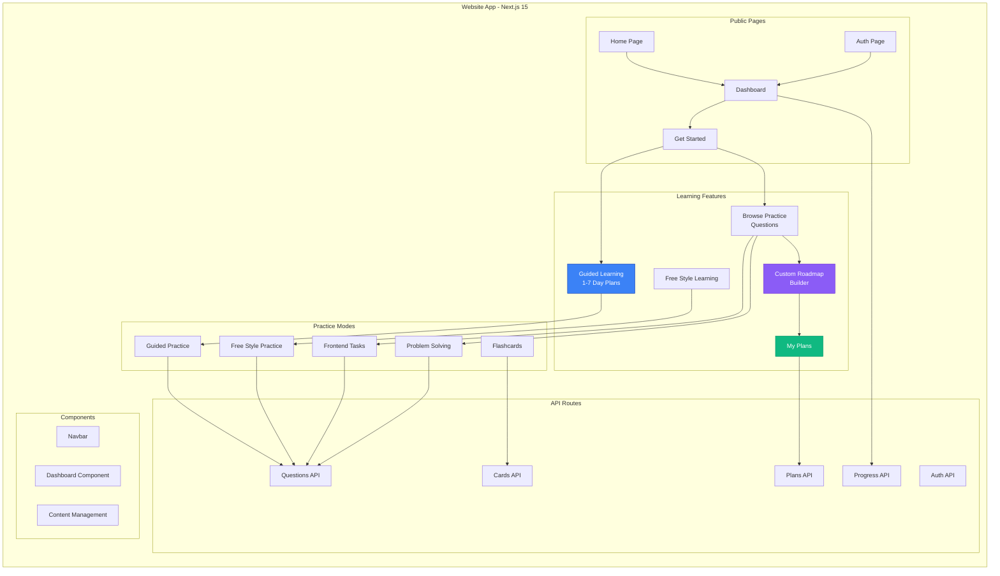
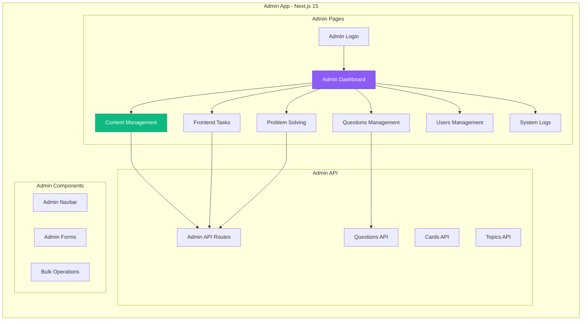
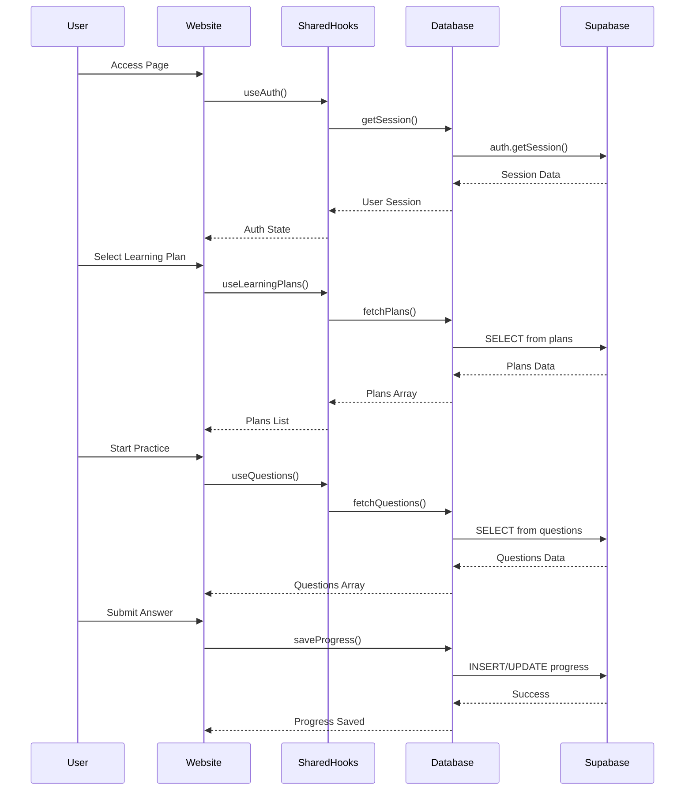
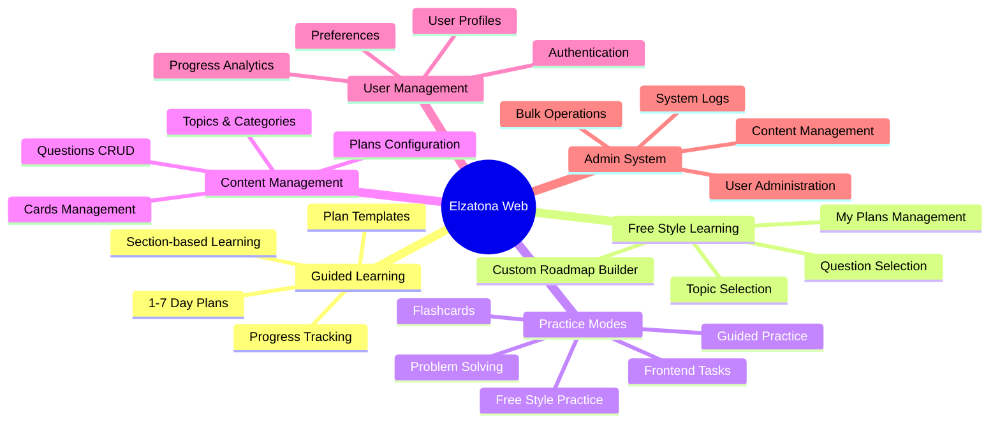
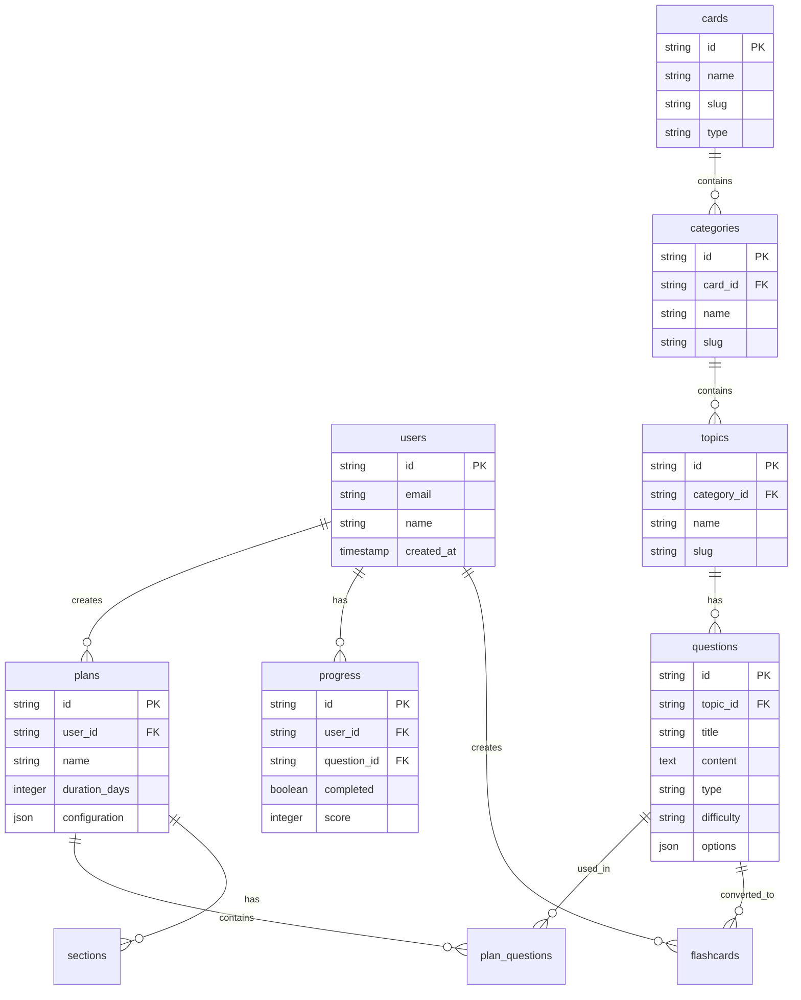
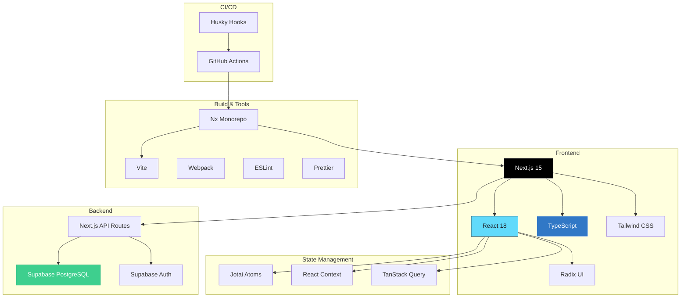
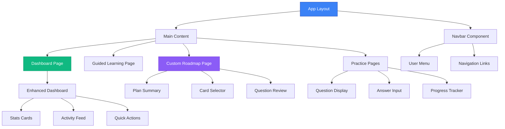

# Elzatona Web - Project Architecture Diagrams

## 🏗️ System Architecture Overview

## 📚 Library Dependencies Graph

## 🌐 Website Application Structure

## 🔐 Admin Application Structure

## 🔄 Data Flow Diagram

## 🎯 Feature Modules

## 🗄️ Database Schema Overview

## 🚀 Technology Stack

## 📦 Component Hierarchy

