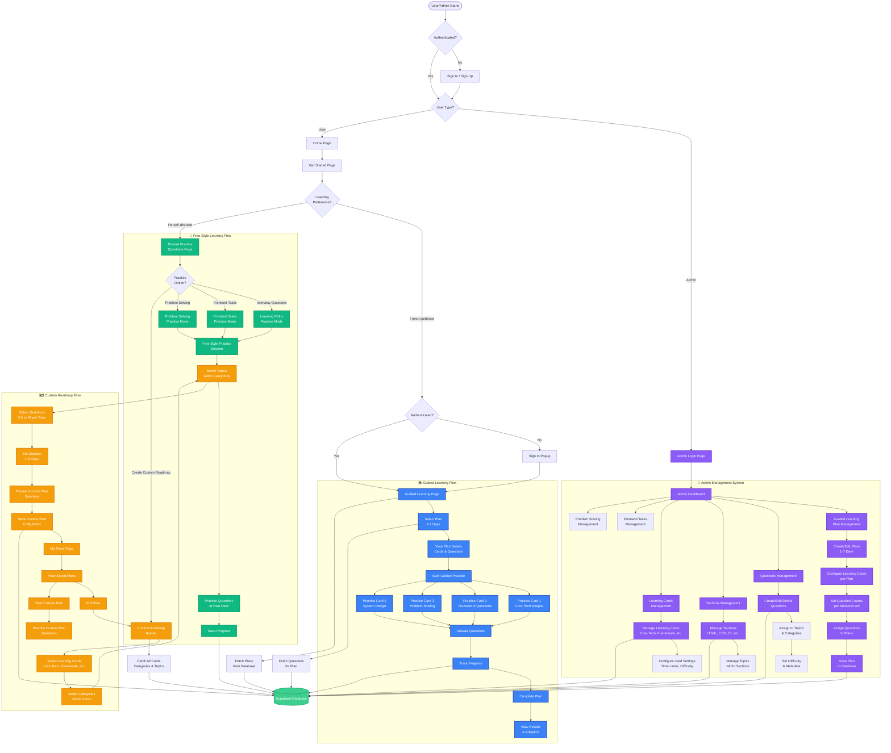

# Elzatona Web - Complete Project Flow Diagram

## 🎯 Complete System Flow: Admin & Website (Guided, Free-Style, Custom Roadmap)

### 📸 Diagram Images

- **PNG Version**: [project-flow-diagram.png](./project-flow-diagram.png) (299KB)
- **SVG Version**: [project-flow-diagram.svg](./project-flow-diagram.svg) (192KB - Recommended for documentation)

### 📝 Mermaid Source

## 📊 Flow Summary

### 🔧 Admin Flow

1. **Admin Login** → Dashboard
2. **Content Management**:
   - Create/Edit Guided Learning Plans (1-7 days)
   - Manage Questions, Sections, Topics
   - Configure Learning Cards
   - Set question counts and distributions
3. **Data Persistence** → All changes saved to Supabase Database

### 📚 Guided Learning Flow

1. **User Selection** → "I need guidance" → Sign In
2. **Plan Selection** → Choose from 1-7 day plans
3. **Practice** → Four learning cards:
   - Core Technologies (HTML, CSS, JS, TS)
   - Framework Questions (React, Next.js, etc.)
   - Problem Solving
   - System Design
4. **Progress Tracking** → Real-time progress saved to database

### 🎯 Free-Style Learning Flow

1. **User Selection** → "I'm self-directed" → Browse Practice Questions
2. **Practice Options**:
   - Interview Questions (Learning Paths)
   - Frontend Tasks
   - Problem Solving
   - Create Custom Roadmap
3. **Flexible Practice** → Select topics and practice at own pace

### 🗺️ Custom Roadmap Flow

1. **Roadmap Builder** → Select Cards → Categories → Topics → Questions
2. **Configuration** → Set duration (1-N days), select 3-5 or all questions per topic
3. **Save & Manage** → Save to "My Plans", view/edit/start saved plans
4. **Practice** → Follow custom plan with selected questions

## 🔄 Key Features

- **Admin**: Full CRUD operations for all content types
- **Guided**: Structured 1-7 day plans with cumulative questions
- **Free-Style**: Flexible topic selection and practice
- **Custom Roadmap**: User-created personalized learning paths
- **Progress Tracking**: All modes track and save user progress
- **Database**: Centralized Supabase storage for all data
