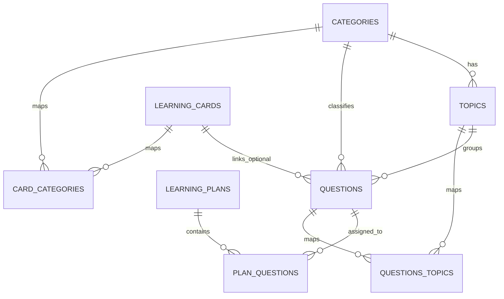

# Admin Content Schema and NotebookLM Seeding Guide

## Purpose

This guide describes the schema you need to generate and seed questions and related content from NotebookLM resources.

It covers:

- questions
- learning_cards
- topics
- categories
- learning_plans
- join tables used in guided and content-management flows

## Entity Overview

### categories

Required fields:

- id (uuid, generated)
- name
- slug

Common optional fields:

- description
- card_type
- icon
- color
- order_index
- is_active

### topics

Required fields:

- id (uuid, generated)
- category_id (fk categories.id)
- name
- slug

Common optional fields:

- description
- order_index
- is_active

### learning_cards

Common fields in code paths:

- id (uuid, generated)
- category_id (fk categories.id)
- topic_id (fk topics.id)
- title
- content
- type
- difficulty
- order_index
- is_active

### questions

Required fields:

- id (uuid, generated)
- title
- content
- type

Operationally important optional fields:

- difficulty
- points
- options
- correct_answer
- explanation
- category_id
- topic_id
- learning_card_id
- tags
- hints
- resources
- metadata
- code
- is_active

### learning_plans

Common fields in code paths:

- id (uuid, generated)
- title
- description
- category_id
- status
- is_public

### join tables

- plan_questions(plan_id, question_id, topic_id, order_index, is_active)
- questions_topics(question_id, topic_id, order_index, is_primary)
- card_categories(card_id, category_id, order_index, is_primary)

## Learning Modes

The platform has three learner modes:

- guided
- free-style
- custom

Store mode targeting in one or both places:

- metadata.learning_modes array
- tags array

Recommended values:

- metadata.learning_modes: ["guided", "free-style", "custom"]
- tags include the same mode tokens for filtering/search

## NotebookLM Output Contract

Ask NotebookLM to output JSON with this shape:

```json
{
  "items": [
    {
      "resource_title": "string",
      "resource_url": "string",
      "category": "string",
      "topic": "string",
      "question": "string",
      "question_type": "multiple-choice|true-false|code",
      "difficulty": "beginner|intermediate|advanced",
      "options": ["string"],
      "correct_answer": "string",
      "explanation": "string",
      "learning_modes": ["guided", "free-style", "custom"],
      "tags": ["string"]
    }
  ]
}
```

Then transform into the seeder structure in tools/seed/starter-data.json format.

## Seeder Input File

Use this file:

- tools/seed/starter-data.json

Template is available at:

- tools/seed/starter-data.template.json

## How to Seed After NotebookLM Export

1. Export NotebookLM JSON.
2. Normalize categories and topics to stable slugs.
3. Map each item into seeder question format:

- question -> title/content
- question_type -> type
- learning_modes -> metadata.learning_modes
- tags -> tags + mode tags
- category/topic -> cat_slug/topic_slug

4. Save the final object into tools/seed/starter-data.json.
5. Ensure environment values exist in .env.local:

- NEXT_PUBLIC_SUPABASE_URL
- SUPABASE_SERVICE_ROLE_KEY

6. Run seeder:

- node tools/seed/seed-all.mjs

7. Verify in admin pages:

- /admin/content/questions
- /admin/content-management
- /admin/learning-cards

## Relationship Diagram



## Practical Notes

- Seed categories and topics first so slug mapping resolves to UUIDs.
- Keep question type and difficulty enum values consistent.
- Keep code snippets as plain strings; do not strip newlines.
- Treat join tables as optional stage-two seeding when needed.
