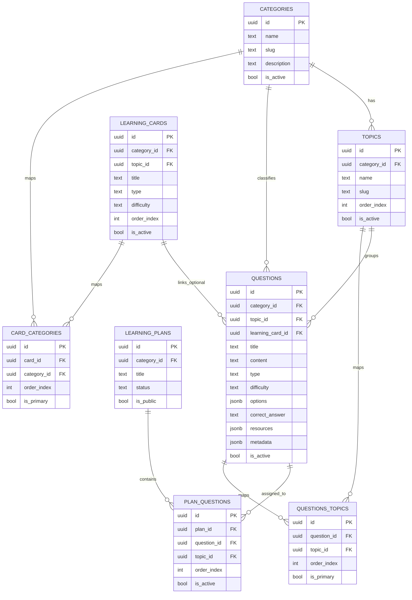

# TDD: Admin Content Schema and NotebookLM Seeding

## Architecture

- NotebookLM output is treated as external source JSON.
- A transform step normalizes output to seeder input schema.
- Seeder upserts lookup entities (categories/topics) first.
- Seeder inserts dependent entities (questions) after lookup maps are built.
- Optional relation seeding (plan_questions, questions_topics, card_categories) runs last.

## Seeder Input Contract

```json
{
  "categories": [
    {
      "name": "JavaScript",
      "slug": "javascript",
      "description": "Core language",
      "card_type": "concept",
      "icon": "code",
      "color": "#f7df1e",
      "order_index": 1
    }
  ],
  "topics": [
    {
      "name": "Closures",
      "slug": "closures",
      "cat_slug": "javascript"
    }
  ],
  "questions": [
    {
      "title": "What is a closure?",
      "content": "Explain closure with one practical example.",
      "type": "multiple-choice",
      "difficulty": "beginner",
      "points": 1,
      "options": [
        {
          "id": "A",
          "text": "Function + lexical scope"
        },
        {
          "id": "B",
          "text": "A new data type"
        }
      ],
      "correct_answer": "A",
      "explanation": "Closures keep lexical bindings.",
      "cat_slug": "javascript",
      "topic_slug": "closures",
      "metadata": {
        "learning_modes": ["guided", "free-style", "custom"]
      },
      "tags": ["guided", "free-style", "custom", "javascript"],
      "resources": [
        {
          "type": "article",
          "title": "MDN Closures",
          "url": "https://developer.mozilla.org/en-US/docs/Web/JavaScript/Closures"
        }
      ]
    }
  ]
}
```

## NotebookLM Extraction Prompt Contract

Use this structure for NotebookLM output before transform:

```json
{
  "items": [
    {
      "resource_title": "string",
      "resource_url": "string",
      "category": "string",
      "topic": "string",
      "question": "string",
      "question_type": "multiple-choice|true-false|code",
      "difficulty": "beginner|intermediate|advanced",
      "options": ["string"],
      "correct_answer": "string",
      "explanation": "string",
      "learning_modes": ["guided", "free-style", "custom"],
      "tags": ["string"]
    }
  ]
}
```

## Data Model Diagram



## Validation Rules

- Question type must map to DB supported values.
- Difficulty must be one of beginner, intermediate, advanced.
- cat_slug and topic_slug must resolve to existing rows after upsert.
- learning modes must be subset of guided, free-style, custom.
- resources entries must contain type, title, and url.
