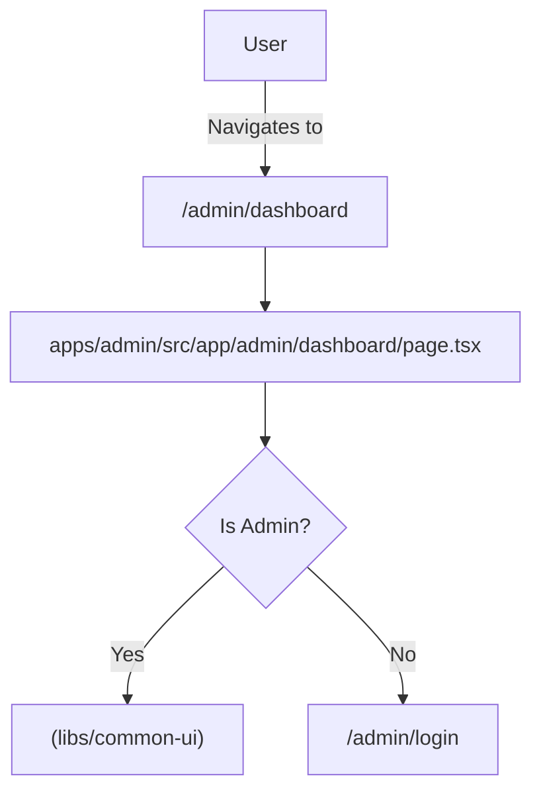

# Specification: Admin Dashboard Wiring

## 1. Overview

This specification defines the refactoring and wiring of the Admin Dashboard page (`/admin/dashboard`).
The goal is to cleanly separate the Admin Dashboard implementation from the Website app by utilizing the shared `AdminDashboard` component located in `libs/common-ui`.

## 2. Requirements

- **Target Route**: `/admin/dashboard` (inside `apps/admin`)
- **Source Component**: `AdminDashboard` (from `@elzatona/common-ui`)
- **Strict Separation**: No admin-specific logic should remain in `apps/website`.
- **Authentication**: The page must be protected (requiring admin auth).

## 3. Architecture & Flow

## 4. Implementation Steps

1.  **Create Page File**:
    - Location: `apps/admin/src/app/admin/dashboard/page.tsx`
    - Content: Import `AdminDashboard` from `common-ui`.
    - Ensure it is a Client Component (`"use client"`).

2.  **Dependencies**:
    - Ensure `apps/admin` has access to `@elzatona/common-ui`. (Already confirmed via current config).

3.  **Verification**:
    - Visit `http://localhost:4200/admin/dashboard` (or relevant admin port).
    - Confirm Dashboard renders correctly.
