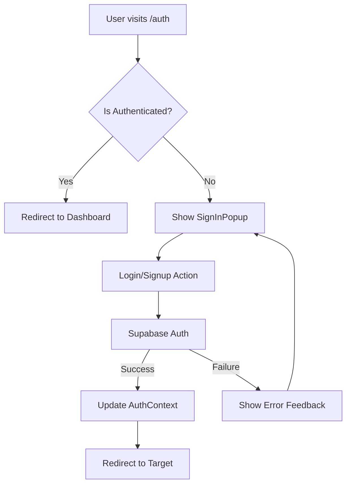

# Specification: Authentication Flow (Phase 2)

## Overview
This phase focuses on refactoring and standardizing the authentication flow across the Elzatona platform. This includes login, signup, and social authentication using Supabase.

## Requirements
- **Consistency**: Use the same `SignInPopup` and auth logic for both Website and Admin (where applicable).
- **Separation**: Move auth UI components to `libs/common-ui/src/auth`.
- **UX**: Smooth transitions, validation feedback, and persistent sessions.
- **Security**: Strict type checking and secure handle of Supabase tokens.

## Architecture Flow


## Implementation Steps
### 1. Library Standardization
- Standardize `SignInPopup.tsx` and `AuthContext.tsx` in `libs/common-ui` and `libs/contexts`.
- Ensure mobile responsiveness and dark mode support.

### 2. Website Integration
- Update `apps/website/src/app/auth/page.tsx` to use the standardized components.
- Implement proper redirection logic after login.

### 3. Verification
- Test all auth providers (Email, Google, GitHub if applicable).
- Verify redirection loops are resolved.
- Run Playwright auth tests.
```
