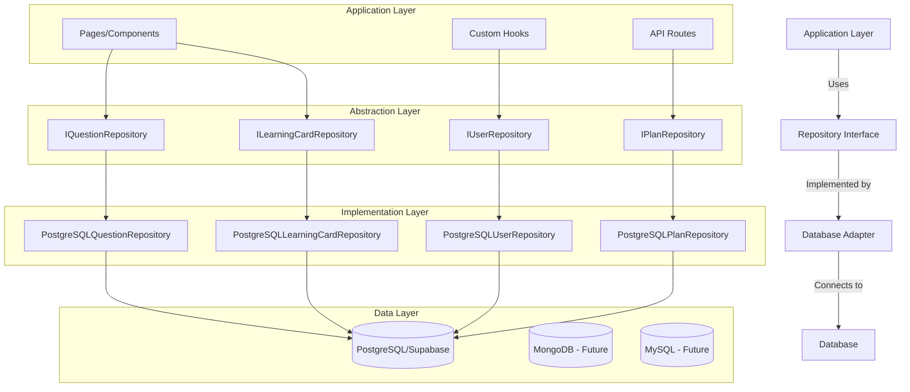

# Specification: Database Abstraction Layer

## Overview

Implement a comprehensive database abstraction layer using the Repository pattern to decouple the application from direct database dependencies. This enables database-agnostic architecture, improved testability, and simplified maintenance while migrating from direct Supabase client calls to a clean, maintainable abstraction.

**Target Scope:**

- Create repository interfaces for core entities (Questions, Users, Plans, Learning Cards)
- Implement PostgreSQL adapters using existing Supabase client
- Migrate consuming pages to use repository pattern
- Establish testing infrastructure for data layer

**Expected Outcome:**

- 100% database-agnostic application code
- Clear separation between business logic and data access
- Improved testability with mock repositories
- Foundation for multi-database support (PostgreSQL, MongoDB, MySQL)

## Requirements

- **Target**: `libs/database/src/repositories/` and `libs/database/src/adapters/`
- **Current State**: Direct Supabase client calls scattered across application
- **Key Principles**:
  - Repository Pattern
  - Dependency Inversion (SOLID)
  - Database Agnostic
  - Interface-Based Design

## Architecture Flow



## Repository Interfaces

### 1. IQuestionRepository

**Responsibilities:**

- CRUD operations for questions
- Filter and search operations
- Batch operations
- Question statistics

**Key Methods:**

```typescript
interface IQuestionRepository {
  // Create
  create(question: CreateQuestionDTO): Promise<Question>;
  createBatch(questions: CreateQuestionDTO[]): Promise<Question[]>;

  // Read
  findById(id: string): Promise<Question | null>;
  findAll(options?: QueryOptions): Promise<Question[]>;
  findByCategory(
    categoryId: string,
    options?: QueryOptions,
  ): Promise<Question[]>;
  findByTopic(topicId: string, options?: QueryOptions): Promise<Question[]>;
  findByDifficulty(
    difficulty: string,
    options?: QueryOptions,
  ): Promise<Question[]>;
  search(query: string, options?: QueryOptions): Promise<Question[]>;
  count(filters?: QuestionFilters): Promise<number>;

  // Update
  update(id: string, data: UpdateQuestionDTO): Promise<Question>;
  updateBatch(
    updates: Array<{ id: string; data: UpdateQuestionDTO }>,
  ): Promise<Question[]>;

  // Delete
  delete(id: string): Promise<void>;
  deleteBatch(ids: string[]): Promise<void>;

  // Statistics
  getStatistics(): Promise<QuestionStatistics>;
}
```

### 2. IUserRepository

**Responsibilities:**

- User management
- User progress tracking
- User preferences
- Authentication support

**Key Methods:**

```typescript
interface IUserRepository {
  // Create
  create(user: CreateUserDTO): Promise<User>;

  // Read
  findById(id: string): Promise<User | null>;
  findByEmail(email: string): Promise<User | null>;
  findAll(options?: QueryOptions): Promise<User[]>;

  // Update
  update(id: string, data: UpdateUserDTO): Promise<User>;
  updateProgress(userId: string, progress: UserProgress): Promise<void>;
  updatePreferences(
    userId: string,
    preferences: UserPreferences,
  ): Promise<void>;

  // Delete
  delete(id: string): Promise<void>;

  // Statistics
  getUserStatistics(userId: string): Promise<UserStatistics>;
}
```

### 3. IPlanRepository

**Responsibilities:**

- Learning plan management
- Plan enrollment
- Progress tracking
- Plan statistics

**Key Methods:**

```typescript
interface IPlanRepository {
  // Create
  create(plan: CreatePlanDTO): Promise<Plan>;

  // Read
  findById(id: string): Promise<Plan | null>;
  findAll(options?: QueryOptions): Promise<Plan[]>;
  findByCategory(categoryId: string): Promise<Plan[]>;
  findUserEnrollments(userId: string): Promise<Plan[]>;

  // Update
  update(id: string, data: UpdatePlanDTO): Promise<Plan>;
  enrollUser(planId: string, userId: string): Promise<void>;
  updateProgress(
    planId: string,
    userId: string,
    progress: number,
  ): Promise<void>;

  // Delete
  delete(id: string): Promise<void>;
  unenrollUser(planId: string, userId: string): Promise<void>;

  // Statistics
  getPlanStatistics(planId: string): Promise<PlanStatistics>;
}
```

### 4. ILearningCardRepository

**Responsibilities:**

- Learning card management
- Card categorization
- User card interactions
- Card statistics

**Key Methods:**

```typescript
interface ILearningCardRepository {
  // Create
  create(card: CreateLearningCardDTO): Promise<LearningCard>;
  createBatch(cards: CreateLearningCardDTO[]): Promise<LearningCard[]>;

  // Read
  findById(id: string): Promise<LearningCard | null>;
  findAll(options?: QueryOptions): Promise<LearningCard[]>;
  findByCategory(categoryId: string): Promise<LearningCard[]>;
  findByTopic(topicId: string): Promise<LearningCard[]>;

  // Update
  update(id: string, data: UpdateLearningCardDTO): Promise<LearningCard>;

  // Delete
  delete(id: string): Promise<void>;
  deleteBatch(ids: string[]): Promise<void>;

  // User Interactions
  recordView(cardId: string, userId: string): Promise<void>;
  recordMastery(cardId: string, userId: string, level: number): Promise<void>;
}
```

## Implementation Steps

### Phase 1: Repository Interface Creation (Week 1, Days 1-2)

1. **Setup Directory Structure**
   - Create `libs/database/src/repositories/interfaces/`
   - Create `libs/database/src/repositories/dto/`
   - Create `libs/database/src/repositories/types/`
   - Verification: Directory structure exists

2. **Define Core Types and DTOs**
   - Create DTOs for Create/Update operations
   - Define QueryOptions, Filters, and Statistics types
   - Create shared repository types
   - Verification: All types compile without errors

3. **Create Repository Interfaces**
   - Implement `IQuestionRepository.ts`
   - Implement `IUserRepository.ts`
   - Implement `IPlanRepository.ts`
   - Implement `ILearningCardRepository.ts`
   - Verification: All interfaces follow consistent patterns

### Phase 2: PostgreSQL Adapter Implementation (Week 1, Days 3-5)

1. **Setup Adapter Infrastructure**
   - Create `libs/database/src/adapters/postgresql/`
   - Setup base adapter configuration
   - Create Supabase client wrapper
   - Verification: Infrastructure compiles

2. **Implement Question Repository Adapter**
   - Create `PostgreSQLQuestionRepository.ts`
   - Migrate existing Supabase query logic
   - Implement all interface methods
   - Verification: All methods implemented, no TypeScript errors

3. **Implement User Repository Adapter**
   - Create `PostgreSQLUserRepository.ts`
   - Migrate user management logic
   - Implement progress tracking
   - Verification: Authentication flows work correctly

4. **Implement Plan Repository Adapter**
   - Create `PostgreSQLPlanRepository.ts`
   - Migrate plan management logic
   - Implement enrollment tracking
   - Verification: Plan operations work correctly

5. **Implement Learning Card Repository Adapter**
   - Create `PostgreSQLLearningCardRepository.ts`
   - Migrate card management logic
   - Implement user interactions
   - Verification: Card operations work correctly

### Phase 3: Dependency Injection Setup (Week 2, Days 1-2)

1. **Create Repository Factory**
   - Implement factory pattern for repository creation
   - Setup dependency injection container
   - Create configuration management
   - Verification: Repositories can be instantiated

2. **Create React Context Providers**
   - Setup repository context providers
   - Create custom hooks for repository access
   - Implement repository service layer
   - Verification: Repositories accessible in components

3. **Setup API Route Integration**
   - Create middleware for repository injection
   - Update API routes to use repositories
   - Implement error handling
   - Verification: API routes work with repositories

### Phase 4: Testing Infrastructure (Week 2, Days 3-4)

1. **Unit Tests for Interfaces**
   - Create mock repository implementations
   - Test interface contracts
   - Verify type safety
   - Verification: ≥90% coverage for interfaces

2. **Integration Tests for Adapters**
   - Setup test database connection
   - Test CRUD operations
   - Test query operations
   - Test error scenarios
   - Verification: ≥80% coverage for adapters

3. **End-to-End Tests**
   - Test complete data flows
   - Test repository factory
   - Test context providers
   - Verification: All critical paths covered

### Phase 5: Migration (Week 2, Day 5 - Week 3)

1. **Migrate High-Priority Pages**
   - Update `guided-practice/page.tsx`
   - Update `content-management/page.tsx`
   - Update `free-style-practice/page.tsx`
   - Verification: Pages work with new repository layer

2. **Migrate API Routes**
   - Update question routes
   - Update user routes
   - Update plan routes
   - Verification: All routes functional

3. **Remove Direct Supabase Calls**
   - Search for remaining direct calls
   - Replace with repository calls
   - Update imports
   - Verification: No direct Supabase imports in app code

### Phase 6: Quality Gates (Week 3, End)

1. **Run Quality Scans**
   - Execute SonarQube analysis
   - Run GitHub SAST scan
   - Check test coverage
   - Verification: All gates pass

2. **Performance Testing**
   - Benchmark query performance
   - Compare with direct Supabase calls
   - Optimize slow queries
   - Verification: No performance regression

3. **Documentation**
   - Update API documentation
   - Create migration guide
   - Document repository usage patterns
   - Verification: All docs complete

## Logic Separation

### Data Access Layer

- **Repository Interfaces**: Define contracts for data operations
- **Adapters**: Implement database-specific logic
- **DTOs**: Define data transfer objects
- **Types**: Shared types and interfaces

### Service Layer

- **Repository Factory**: Create and configure repositories
- **Dependency Injection**: Provide repositories to consumers
- **Error Handling**: Centralized error management
- **Caching**: Optional caching layer

### Application Layer

- **Custom Hooks**: Access repositories via hooks
- **API Routes**: Use repositories for data operations
- **Components**: Consume data through hooks
- **State Management**: Manage UI state separately from data

## Migration Strategy

### Backward Compatibility Approach

1. **Parallel Implementation**
   - Keep existing Supabase calls working
   - Add repository layer alongside
   - Gradually migrate consumers
   - No breaking changes during migration

2. **Feature Flags**
   - Use environment variables to toggle repository usage
   - Test new implementation in isolation
   - Rollback capability if issues found

3. **Incremental Migration**
   - Migrate one entity type at a time
   - Start with Questions (most used)
   - Then Users, Plans, Learning Cards
   - Verify each before moving to next

### Rollback Plan

If issues are encountered:

1. Disable feature flag
2. Revert to direct Supabase calls
3. Fix issues in repository layer
4. Re-enable after verification

## Success Metrics

### Code Quality

- ✅ SonarQube quality gate: PASS
- ✅ 0 critical security issues
- ✅ <3% code duplication
- ✅ <5% technical debt

### Testing

- ✅ Unit test coverage: ≥90%
- ✅ Integration test coverage: ≥80%
- ✅ All tests passing
- ✅ No flaky tests

### Performance

- ✅ Query performance: No regression
- ✅ API response times: <500ms (p95)
- ✅ Database connection pooling: Configured
- ✅ Query optimization: Applied

### Architecture

- ✅ Zero direct Supabase imports in app code
- ✅ All data access through repositories
- ✅ Consistent error handling
- ✅ Complete TypeScript type safety

## Security Considerations

### Input Validation

- ✅ Validate all DTOs before database operations
- ✅ Sanitize user inputs
- ✅ Prevent SQL injection (use parameterized queries)

### Authorization

- ✅ Implement row-level security checks
- ✅ Verify user permissions in repository layer
- ✅ Audit log for sensitive operations

### Data Protection

- ✅ No sensitive data in logs
- ✅ Secure database credentials
- ✅ Encrypted connections

## Dependencies

### Required Libraries

- `@supabase/supabase-js` - Existing Supabase client
- `zod` - Runtime type validation
- `jest` - Testing framework
- `@testing-library/react` - Component testing

### Internal Dependencies

- `@elzatona/types` - Shared TypeScript types
- `@elzatona/utilities` - Shared utility functions

## Timeline

- **Week 1**: Repository interfaces + PostgreSQL adapters
- **Week 2**: DI setup + Testing infrastructure + Start migration
- **Week 3**: Complete migration + Quality gates + Documentation

**Total Duration**: 3 weeks

## Risks and Mitigation

### Risk 1: Performance Regression

- **Mitigation**: Benchmark all queries, optimize before migration
- **Rollback**: Feature flag to revert to direct calls

### Risk 2: Breaking Changes

- **Mitigation**: Parallel implementation, gradual migration
- **Rollback**: Keep old implementation until verified

### Risk 3: Incomplete Migration

- **Mitigation**: Automated search for direct Supabase calls
- **Verification**: ESLint rule to prevent direct imports

### Risk 4: Testing Gaps

- **Mitigation**: Mandatory 80%+ coverage before merge
- **Verification**: CI/CD blocks merge if coverage drops

## Approval Checklist

- [ ] Architecture review completed
- [ ] Repository interfaces approved
- [ ] Testing strategy approved
- [ ] Migration plan approved
- [ ] Security review completed
- [ ] Timeline approved
- [ ] Resource allocation confirmed

---

**Specification Status**: ✅ READY FOR IMPLEMENTATION  
**Last Updated**: January 18, 2026  
**Created By**: Database Abstraction Team  
**Reviewers**: TBD
